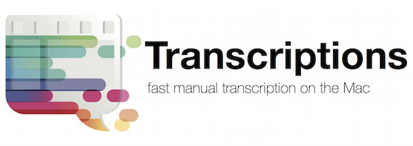
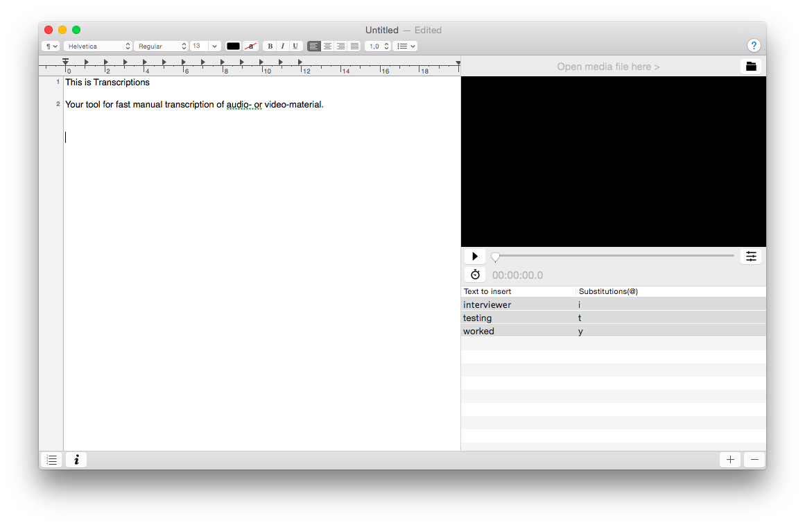

A text editor optimized for fast manual transcription of audio- or video material on the Mac.

Used around the world in research, education and journalism since 2008.

> Requirements: MacOS or Mac OS X 10.11 El Capitan or later
> For Mac OSX 10.9 Mavericks and below, use version 0.8 that can be found [here](https://code.google.com/p/transcriptions/downloads/list).

**Check out the [app overview](README-images/transcriptionsAppOverview.pdf) to get started.**

## Features ##

  * Media with tape behavior
  * Customizeable media-control shortcuts([->shortcut recorder](https://github.com/Kentzo/ShortcutRecorder))
  * Timestamps
  * Text substitution
  * Footpedal-support([->audiotranskription.de](http://www.audiotranskription.de/deutsch/transkription/usb-fussschalter-f-pro/usb-fussschalter-f-pro.html))
  
Load media in the player, use the controls to adjust speed and volume, set keyboard shortcuts for media control in the preferences pane and type away. Transcriptions also supports text-substitutions by inserting "@" followed by a text-token.

## Transcriptions is [Free/Libre Open Source Software](https://en.wikipedia.org/wiki/Free_and_open-source_software) ##
The source code of Transcriptions is released under the [BSD License](https://en.wikipedia.org/wiki/BSD_licenses) and can be checked out on [GitHub](https://github.com/soleil-alpin/Transcriptions). 
Please support development by [buying Transcriptions in the Mac AppStore](https://itunes.apple.com/at/app/transcriptions/id911974149?l=en&mt=12) or by [donating via PayPal](http://www.unet.univie.ac.at/~a0206600/TranscriptionsDonate.html). 

`Thanks to all supporters!`

**MBW Pick of the week: March 30, 2010**

Transcriptions source code is used in the application [F5(Mac)](http://www.audiotranskription.de/f5.htm).

## Screenshot ##

## Version History ##
**Version 1.2**
 * MacOS or Mac OS X 10.11 El Capitan or later

**Version 1.0**
  * Mac OSX 10.10 Yosemite

**Version 0.8**
  * Mac OSX 10.5 Leopard
  * [Perian](http://perian.org/) and [Flip4Mac](http://www.microsoft.com/windows/windowsmedia/player/wmcomponents.mspx) **recommended**

Sparkle is used up to Version 0.8. Please download the [binary from the Mac App Store](https://itunes.apple.com/at/app/transcriptions/id911974149?l=en&mt=12) to get updates starting from Version 1.0.

## Support ##
Find support [here](https://github.com/soleil-alpin/Transcriptions/issues).

## Development ##
### Requirements ###

If you wish to build Transcriptions yourself, you will need the following components/tools:

* a recent Xcode with support for ARC and subscripting
* OS X SDK (10.10 or later)
* Git

### Environment Setup

After cloning the repository, run the following commands inside the repository root (directory containing this `README.md` file):

    git submodule update --init --recursive

You can then open the Xcode project file and build.
 
 
_[Soleil Alpin Legal Information](https://soleil-alpin.com/legalsolalp.html)_

_Mac, MacOS and OS X are trademarks of Apple, Inc._
